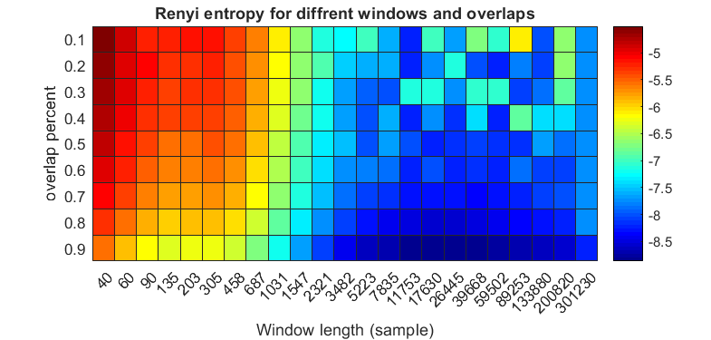
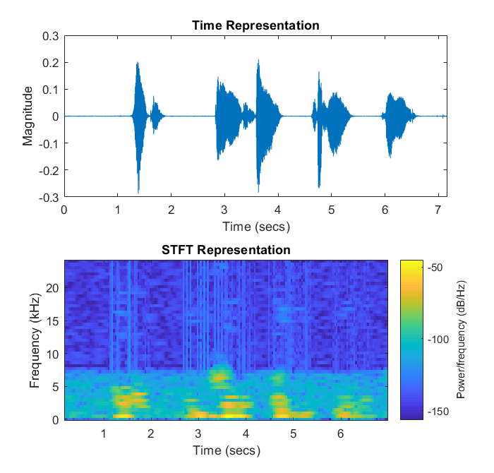
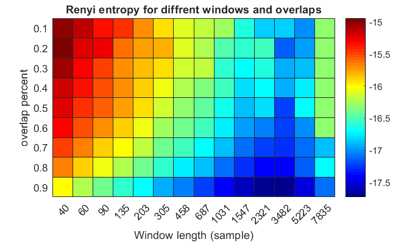
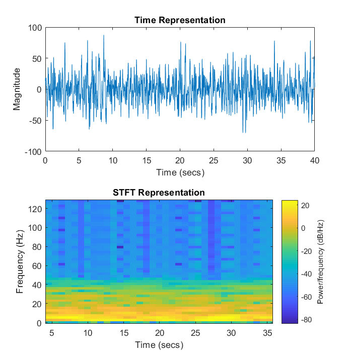
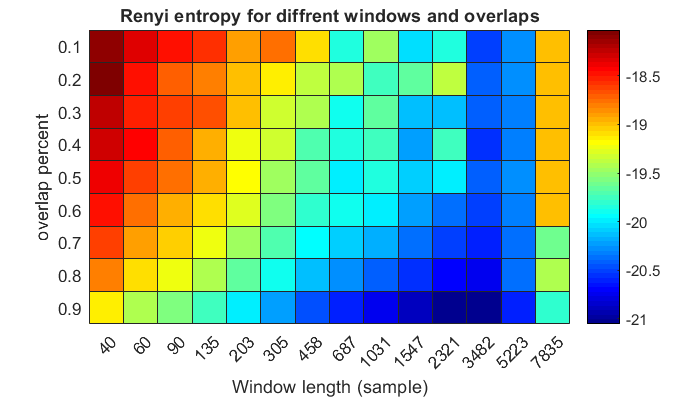
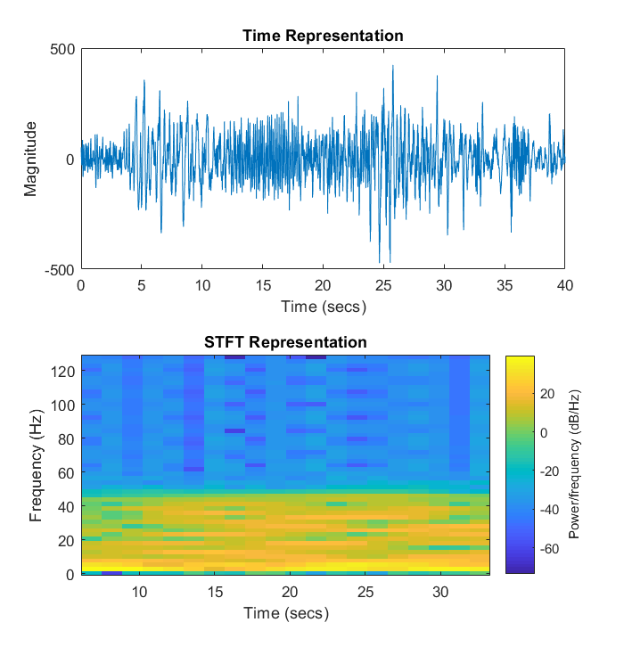

# Analysis of Short-Time Fourier Transform (STFT) and Renyie Entropy on EEG and Speech signals
This repository contains some codes for selecting the best
- Window Length 
- Overlap.

Note that window type is rectangular and FFT Window resolution is 100.

### Results for Human voice signal

After applying Renyie Entropy with different window length and overlap, the result can be represented as a heatmap figure:

Then we apply best conditions (minimum Entropy) on image and show the STFT Representatin:

### Results for preprocessed non-siezure EEG Signal 

### Results for preprocessed siezure EEG Signal

## Data License
Data were collected from CHB-MIT Scalp EEG Database provided by physionet.

[Open Data Commons Attribution License](https://physionet.org/content/chbmit/view-license/1.0.0/)

Goldberger, A., Amaral, L., Glass, L., Hausdorff, J., Ivanov, P. C., Mark, R., ... & Stanley, H. E. (2000). PhysioBank, PhysioToolkit, and PhysioNet: Components of a new research resource for complex physiologic signals. Circulation \[Online]. 101 (23), pp. e215–e220.